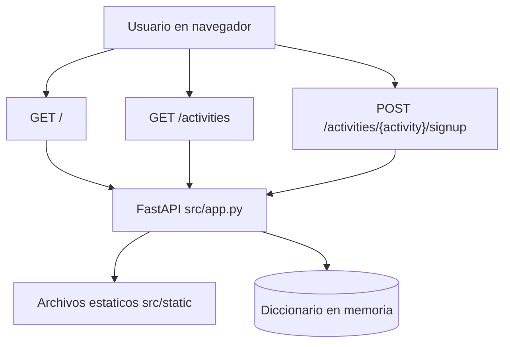
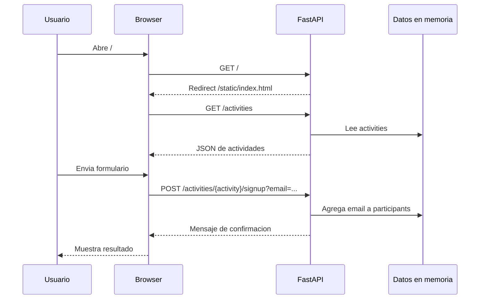

# Diseno funcional y tecnico

## 1. Resumen ejecutivo

Este repositorio implementa una aplicacion web pequena para gestionar actividades extracurriculares de una escuela ficticia, Mergington High School. La solucion combina un backend en FastAPI con una interfaz web estatica servida por el mismo proceso.

El sistema permite dos capacidades principales:

- Consultar las actividades disponibles.
- Registrar a un estudiante en una actividad mediante su correo electronico.

Su objetivo es didactico: mostrar una API simple, una UI basica y un flujo cliente-servidor minimo para ejercicios relacionados con GitHub Copilot.

## 2. Alcance funcional

### Funcionalidades incluidas

1. Visualizacion de actividades disponibles.
2. Consulta de descripcion, horario y cupos restantes por actividad.
3. Seleccion de una actividad desde un formulario.
4. Registro de un estudiante por correo electronico en una actividad.
5. Mensajes de exito o error en la interfaz.

### Funcionalidades no incluidas

1. Persistencia en base de datos.
2. Autenticacion o autorizacion.
3. Validacion avanzada de reglas de negocio.
4. Prevencion de registros duplicados.
5. Control de sobrecupo.
6. Gestion de estudiantes como entidad independiente.
7. Suite de pruebas automatizadas.

## 3. Actores y casos de uso

### Actor principal

- Estudiante que desea consultar y registrarse en actividades extracurriculares.

### Casos de uso

1. Consultar actividades.
2. Revisar detalles de una actividad.
3. Seleccionar una actividad desde la UI.
4. Enviar un correo electronico para registrarse.
5. Recibir confirmacion o mensaje de error.

## 4. Flujo funcional

### Flujo principal

1. El usuario accede a la raiz `/`.
2. El backend redirige a `/static/index.html`.
3. La pagina carga `app.js` y `styles.css`.
4. El navegador ejecuta una llamada `GET /activities`.
5. La UI renderiza las tarjetas de actividades y llena el selector del formulario.
6. El usuario introduce su correo y elige una actividad.
7. La UI ejecuta `POST /activities/{activity_name}/signup?email=...`.
8. El backend agrega el correo a la lista en memoria y devuelve un mensaje de confirmacion.
9. La UI muestra el resultado al usuario.

### Flujo alterno

1. Si la actividad no existe, el backend responde `404 Activity not found`.
2. Si falla la carga inicial de actividades, la UI muestra un mensaje generico de error.
3. Si falla el registro, la UI muestra un mensaje de error sin reintento automatico.

## 5. Diseno tecnico

### Arquitectura

La arquitectura es monolitica y ligera. Un unico proceso FastAPI sirve tanto la API HTTP como los archivos estaticos del frontend.



### Componentes principales

1. Backend HTTP en `src/app.py`.
2. Frontend estatico en `src/static/index.html`, `src/static/app.js` y `src/static/styles.css`.
3. Configuracion de entorno en `.devcontainer/devcontainer.json`.
4. Dependencias Python declaradas en `requirements.txt`.
5. Configuracion de pytest en `pytest.ini`.

## 6. Estructura del repositorio

```text
.
|- .devcontainer/
|  `- devcontainer.json
|- .github/
|- .vscode/
|- src/
|  |- static/
|  |  |- app.js
|  |  |- index.html
|  |  `- styles.css
|  |- README.md
|  `- app.py
|- AGENTS.md
|- README.md
|- pytest.ini
`- requirements.txt
```

### Responsabilidad por archivo

- `README.md`: entrada general del ejercicio en GitHub Skills.
- `src/README.md`: descripcion funcional de la mini API.
- `src/app.py`: inicializacion de FastAPI, rutas, redireccion y almacenamiento en memoria.
- `src/static/index.html`: estructura de la interfaz de usuario.
- `src/static/app.js`: logica cliente para consultar actividades y registrar estudiantes.
- `src/static/styles.css`: estilos visuales basicos.
- `requirements.txt`: dependencias necesarias para ejecutar la app.
- `.devcontainer/devcontainer.json`: entorno recomendado de desarrollo.
- `pytest.ini`: configuracion minima de pruebas.
- `AGENTS.md`: convenciones de trabajo sobre el repositorio.

## 7. Diseno del backend

### Framework

El backend utiliza FastAPI como framework web y expone un objeto `app` como punto de entrada ASGI.

### Rutas

#### `GET /`

- Responsabilidad: redirigir al frontend estatico.
- Implementacion: devuelve `RedirectResponse` a `/static/index.html`.

#### `GET /activities`

- Responsabilidad: devolver el catalogo completo de actividades.
- Respuesta: diccionario JSON con actividades indexadas por nombre.

#### `POST /activities/{activity_name}/signup`

- Responsabilidad: registrar un correo en la actividad indicada.
- Parametros:
  - `activity_name`: nombre de la actividad en la URL.
  - `email`: correo del estudiante en query string.
- Validaciones actuales:
  - La actividad debe existir.
- Comportamiento actual:
  - Agrega siempre el correo a la lista de participantes.
  - No verifica duplicados ni capacidad maxima.

### Modelo de datos en memoria

El sistema usa un unico diccionario global llamado `activities` con esta estructura conceptual:

```json
{
  "Nombre actividad": {
    "description": "texto descriptivo",
    "schedule": "horario legible",
    "max_participants": 20,
    "participants": ["correo1@dominio", "correo2@dominio"]
  }
}
```

#### Implicaciones tecnicas

1. Los datos se reinician al reiniciar el proceso.
2. No existe aislamiento entre peticiones ni persistencia transaccional.
3. El modelo es suficiente para una demo, pero no para un entorno multiusuario real.

## 8. Diseno del frontend

### `index.html`

Define una pagina simple con dos zonas funcionales:

1. Listado de actividades disponibles.
2. Formulario de registro con correo y selector de actividad.

### `app.js`

Contiene toda la logica cliente:

1. Espera el evento `DOMContentLoaded`.
2. Consulta `GET /activities`.
3. Renderiza tarjetas con descripcion, horario y cupos restantes.
4. Rellena el `select` con las actividades disponibles.
5. Gestiona el envio del formulario con `fetch`.
6. Muestra mensajes de estado en la pagina.

### `styles.css`

Aplica un estilo basico responsive con:

1. Encabezado destacado.
2. Secciones tipo tarjeta.
3. Estados visuales para mensajes de exito y error.

## 9. Secuencia de interaccion



## 10. Dependencias y entorno

### Dependencias declaradas

- `fastapi`: framework web.
- `uvicorn`: servidor ASGI para ejecucion local.
- `httpx`: soporte potencial para pruebas HTTP o clientes.
- `watchfiles`: soporte para recarga en desarrollo.

### Entorno de desarrollo

El devcontainer usa Python 3.13, instala dependencias desde `requirements.txt` y recomienda extensiones de Python y GitHub Copilot para VS Code.

### Ejecucion local esperada

```bash
pip install -r requirements.txt
python -m uvicorn src.app:app --reload
```

## 11. Calidad tecnica actual

### Fortalezas

1. Codigo pequeno y facil de entender.
2. Separacion clara entre backend y frontend estatico.
3. Curva de entrada baja para ejercicios de aprendizaje.
4. Endpoints simples y faciles de probar manualmente.

### Limitaciones y riesgos

1. No hay persistencia de datos.
2. No existe validacion de cupo maximo.
3. No se evita el registro duplicado de correos.
4. No hay validacion de dominio de correo escolar.
5. No hay pruebas automatizadas en el repositorio.
6. El estado global en memoria no es adecuado para concurrencia real.
7. No se modelan errores de negocio mas alla de la existencia de la actividad.

## 12. Recomendaciones de evolucion

1. Incorporar validacion de capacidad y duplicados en el endpoint de registro.
2. Extraer el modelo de actividades a clases Pydantic o esquemas tipados.
3. Agregar pruebas con `pytest` y `fastapi.testclient` o `httpx`.
4. Separar logica de negocio y capa HTTP para mejorar mantenibilidad.
5. Introducir persistencia ligera si el objetivo deja de ser puramente didactico.
6. Mejorar la UI para refrescar el listado tras cada registro exitoso.

## 13. Conclusion

El repositorio implementa una aplicacion de ejemplo, pequena y pedagogica, para demostrar un flujo web completo con FastAPI y JavaScript del lado cliente. Su diseno prioriza simplicidad y legibilidad sobre robustez operativa, lo que lo hace apropiado para aprendizaje, demos y ejercicios guiados, pero insuficiente para escenarios productivos sin una evolucion adicional de validaciones, persistencia y pruebas.